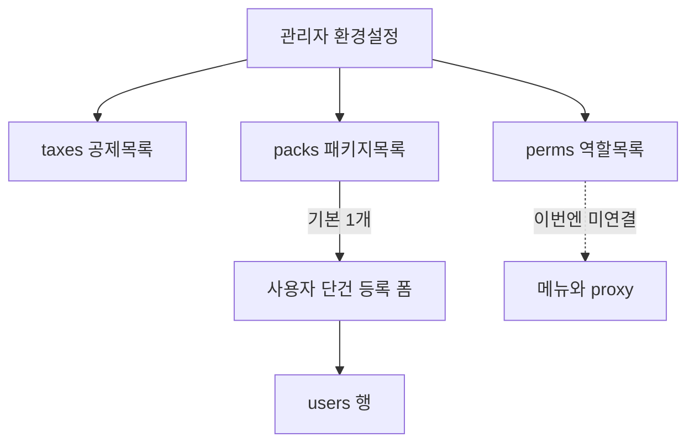

# 환경 설정 저장

관리자가 `/admin/pay`(제목: 환경 설정)에서 세금·급여·권한을 영역별로 펼쳐 편집하고, 각 영역은 자기 테이블에 남긴다. 지금 `public`에는 `users`와 `notices`만 있고 설정 저장소는 없다. 기존 목업(시급·연장·야간, 저장 안 됨)은 이 화면으로 교체한다.

실행 시 같은 내용을 [docs/plans/2026-08-14-003-feat-env-settings-plan.md](docs/plans/2026-08-14-003-feat-env-settings-plan.md)에도 둔다.

**Product Contract preservation:** 브레인스토름에서 확정한 범위를 그대로 둔다.

## Goal Capsule

- **목표:** 관리자가 환경 설정에서 세금 공제 목록, 급여 패키지 목록, 권한 역할 목록을 DB에 저장하고, 사용자 단건 등록 폼은 기본 급여 패키지 숫자로 시작한다.
- **권한:** 화면·쓰기는 지금처럼 관리자만. 새 역할 카탈로그는 저장만 하고 메뉴·`proxy`에는 아직 안 묶는다.
- **중단 조건:** 권한 실시간 적용, 엑셀 업로드 프리필, 급여 명세서·4대보험 사업장 부담, 누진 소득세 표, 기존 사용자 일괄 갱신.

## Product Contract

### Summary

환경 설정은 세금 / 급여 / 권한 설정 세 덩어리다. 제목을 누르면 본문이 펼쳐진다. 세금은 공통 요율(%) 항목 목록(추가·삭제). 급여는 패키지 목록 중 기본 1개. 권한은 역할을 추가하고 페이지·기능을 켜고 저장한다.

### Key Decisions

- 저장 위치는 DB. 지금은 어디에도 없음. `(session-settled: user-directed — chosen over 목업 유지: 각 영역 테이블에 남긴다)` Governs R1, R8
- 세금 요율(%)은 회사 공통. `(session-settled: user-directed — chosen over 사람별 세금)` Governs R2
- 세금은 고정 5칸이 아니라 공제 항목 목록. `(session-settled: user-directed — chosen over 4대보험+소득세 고정 카드)` Governs R2, R3
- 급여는 전체 항목 패키지, 기본 1개 + 추가 목록. `(session-settled: user-directed — chosen over 숫자 1세트만)` Governs R4, R5
- 시급 = 기본급 ÷ 월 소정근로시간. `(session-settled: user-directed — chosen over 시급 직접 입력)` Governs R5, R7
- 역할 추가까지 UI·저장. 적용은 다음. `(session-settled: user-directed — chosen over 이번 메뉴 차단)` Governs R6, R9
- 이번 적용은 단건 등록 폼 프리필만. `(session-settled: user-directed — chosen over 저장만 / 권한까지 적용)` Governs R7

### Requirements

- R1. 관리자만 환경 설정을 읽고 저장한다. 실패 시 목록을 비우고 안내한다.
- R2. 세금 영역은 공제 이름 + 요율(%) 목록이다. 항목을 추가·수정·삭제한다. 초기 씨드는 국민연금, 건강보험, 장기요양, 고용보험, 소득세(요율 0).
- R3. 세금 요율은 전 직원 공통이다. 사람마다 다르지 않다.
- R4. 급여 영역은 패키지 목록이다. 각 패키지는 이름, 기본급, 월 소정근로시간, 기본 식대, 유류비다. 시급은 저장하지 않고 기본급÷시간으로 보여 준다.
- R5. 패키지 중 기본은 정확히 하나다. 새로 만든 첫 패키지는 기본이 된다. 기본을 지우면 다른 패키지를 기본으로 고른 뒤에만 지운다.
- R6. 권한 영역은 역할 이름을 추가·삭제하고, 페이지·기능 체크를 저장한다. `users.role`의 관리자·직원 제약과 메뉴·`proxy`는 이번엔 그대로다.
- R7. `/admin/users` 단건 등록 폼은 기본 패키지의 기본급·시급(계산값)·식대·유류비를 칸에 넣는다. 관리자가 그 숫자를 고칠 수 있다. 엑셀 업로드는 손대지 않는다.
- R8. 세금·급여·권한은 서로 다른 테이블에 저장한다. 행이 항목(공제 / 패키지 / 역할)이다.
- R9. 기존 사용자 행은 일괄 바꾸지 않는다.

### Actors / Flows / Acceptance

- A1. 관리자 — 환경 설정 편집, 사용자 단건 등록.
- F1. 영역 제목 클릭 → 해당 영역이 펼쳐지거나 접힌다. 여러 영역을 동시에 열 수 있다.
- F2. 세금 항목 저장 → 새로고침 후에도 같은 목록.
- F3. 급여 패키지 기본 지정 → 사용자 등록 폼이 그 숫자로 시작.
- F4. 권한 역할 저장 → DB에는 남고, 직원 메뉴는 지금과 같다.
- AE1. 기본급 3,000,000 / 월 209시간 → 시급 14,354원(원 단위 버림).
- AE2. 패키지가 없으면 등록 폼 급여 칸은 0.

### Scope Boundaries

하지 않음: 권한으로 메뉴·페이지·기능 실제 차단, 엑셀 프리필, 급여 계산서, 사업장 보험 부담, 소득세 누진 표, 연장·야간 수당(구 목업), `/admin/pay` URL 변경, `users.role`에 새 역할 값 넣기.

## Planning Contract

- KTD1. 테이블 세 개. `public.taxes`(공제 행), `public.packs`(패키지 행), `public.perms`(역할 행 + 페이지·기능 플래그 JSON). 국민연금마다 테이블을 나누지 않는다. RLS 켜고 anon 정책 없음. 앱은 기존처럼 secret 키([app/_db/sb.ts](app/_db/sb.ts)).
- KTD2. `taxes`: `id` uuid, `name` text unique, `rate` numeric(6,3) check 0–100, `ord` int. 씨드 5행 요율 0.
- KTD3. `packs`: `id` uuid, `name` text unique, `pay`/`hours`/`meal`/`fuel` int ≥0, `is_def` bool. `is_def is true` 부분 유니크. 시급은 컬럼 없음. 화면·프리필에서 `hours>0`이면 `Math.floor(pay/hours)`, 아니면 0.
- KTD4. `perms`: `id` uuid, `name` text unique, `pages` jsonb, `feats` jsonb. 씨드 `관리자`·`직원`은 현재 메뉴에 맞는 플래그만 넣고, 읽어서 게이트에 쓰지는 않는다.
- KTD5. 쓰기는 `isAdmin()` 서버 액션 + `revalidatePath("/admin/pay")`, 프리필용 `revalidatePath("/admin/users")`. 패턴은 [app/admin/notice/save.ts](app/admin/notice/save.ts).
- KTD6. 경로는 `/admin/pay` 유지. 목업 폼([app/admin/pay/form.tsx](app/admin/pay/form.tsx)) 제거. 아코디언은 [app/_shell/nest.tsx](app/_shell/nest.tsx)처럼 제목 버튼 + `aria-expanded`.
- KTD7. 단건 폼: [app/admin/users/page.tsx](app/admin/users/page.tsx)에서 기본 `pack`을 읽어 [app/admin/users/field.tsx](app/admin/users/field.tsx)에 `defaultValue`로 넘긴다. `etc1`/`etc2`는 0.
- KTD8. 파일당 50행, 식별자 10자/함수 15자, 주석·플랜·커밋 한글.

## Implementation Units

### U1. 세 테이블과 DB 모듈

**Goal:** 세금·패키지·권한을 저장할 테이블과 서버 조회·저장 함수.

**Requirements:** R1, R2, R4, R5, R6, R8

**Files:**
- 신규 `app/_db/tax.ts`, `app/_db/pack.ts`, `app/_db/perm.ts` (list/save, 파일 길면 조회·저장 분리)
- 신규 `app/_db/pack.test.ts` (시급 버림, hours 0 → 0)
- 신규 `app/_db/tax.test.ts` (요율 범위, 씨드 이름)
- Supabase 마이그레이션 (MCP `apply_migration`, 프로젝트 `aqadblbisupsimjahlnf`)

**Approach:**
1. RLS on, 정책 없음, 컬럼 코멘트 한글.
2. taxes 5행 씨드, packs는 씨드 없이 빈 목록 허용(기본 없음 → 프리필 0).
3. perms에 관리자·직원 씨드. pages/feats 키는 코드 상수로 고정.

**Test scenarios:**
- pay 3000000, hours 209 → wage 14354
- hours 0 → wage 0
- rate 0과 100은 허용, 음수·100 초과는 거절

**Verification:** 마이그레이션 후 `list_tables`로 세 테이블 확인. `npm test`.

### U2. 환경 설정 아코디언 화면

**Goal:** 목업을 세금·급여·권한 펼침 편집으로 교체하고 저장한다.

**Requirements:** R1–R6, F1–F4

**Files:**
- [app/admin/pay/page.tsx](app/admin/pay/page.tsx), [app/admin/pay/form.tsx](app/admin/pay/form.tsx) 삭제 또는 교체
- 신규 `app/admin/pay/pane.tsx`(아코디언), `taxs.tsx`, `packs.tsx`, `perms.tsx`, `save.ts` (액션이 길면 영역별 파일)
- [app/_shell/title.ts](app/_shell/title.ts)는 이미 `환경 설정`

**Approach:**
1. 서버 페이지가 세 목록을 읽고 클라이언트 영역에 넘긴다.
2. 영역마다 저장 버튼(영역 단위 저장).
3. 허브 [app/admin/hub.tsx](app/admin/hub.tsx)의 환경 설정 카드만 “저장됩니다”로 구분하거나, 전 카드 문구를 라벨에 맞게 정리한다.

**Test scenarios:**
- 아코디언 제목이 `button`이고 본문을 `label`로 감싸지 않음 (공지 폼 테스트와 같은 성격)
- 관리자가 아니면 액션이 거절

**Verification:** `/admin/pay`에서 세 영역 펼침·저장·새로고침 유지.

### U3. 사용자 등록 폼 프리필

**Goal:** 기본 패키지가 있으면 단건 등록 급여 칸에 넣는다.

**Requirements:** R7, R9, AE1, AE2

**Files:**
- [app/admin/users/page.tsx](app/admin/users/page.tsx), [app/admin/users/shell.tsx](app/admin/users/shell.tsx), [app/admin/users/form.tsx](app/admin/users/form.tsx), [app/admin/users/pays.tsx](app/admin/users/pays.tsx), [app/admin/users/field.tsx](app/admin/users/field.tsx)
- 신규 또는 확장 `app/admin/users/form.test.ts` / `pays` 쪽 순수 함수 테스트

**Approach:**
1. 기본 pack을 users 페이지에서 조회해 Form에 전달.
2. Field에 `val`/`defaultValue` 추가. 시급 칸은 계산값을 보여 주되 사용자가 고치면 그 값이 저장된다(등록 시점 `users.wage`).
3. 엑셀·행 수정은 변경하지 않음.

**Test scenarios:**
- 기본 pack pay/hours/meal/fuel → 폼 초기값
- 기본 pack 없음 → 0
- Covers AE1 / AE2

**Verification:** 환경 설정에서 기본 패키지 저장 후 `/admin/users` 등록 폼 확인.

### U4. README와 트리

**Goal:** 목적·주의·디렉터리 트리를 화면과 맞춤.

**Files:** [README.md](README.md), [.cursor/rules/project-structure.mdc](.cursor/rules/project-structure.mdc), `docs/plans/2026-08-14-003-feat-env-settings-plan.md`

**Test expectation:** none — 문서만.

## Verification Contract

- `npm test`
- 관리자로 `/admin/pay` 저장 후 새로고침
- `/admin/users` 단건 폼이 기본 패키지를 반영
- 직원 계정으로 `/admin/pay` 불가(기존 proxy)
- 직원 메뉴가 권한 저장과 무관하게 공지·근태만

## Definition of Done

- 세 테이블에 데이터가 남고, 목업 급여 폼이 없다.
- 단건 등록만 기본 패키지를 쓴다.
- 권한 카탈로그는 저장되나 접근 제어는 이전과 같다.
- README·트리 갱신, 파일 50행 규칙 준수.
